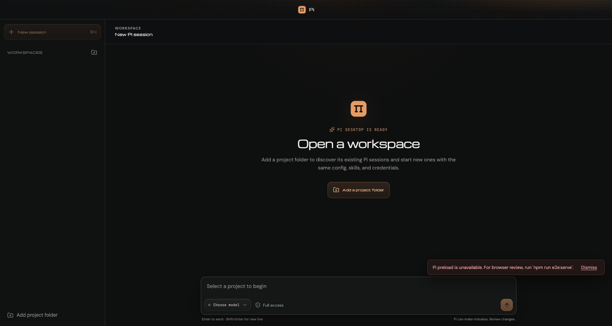
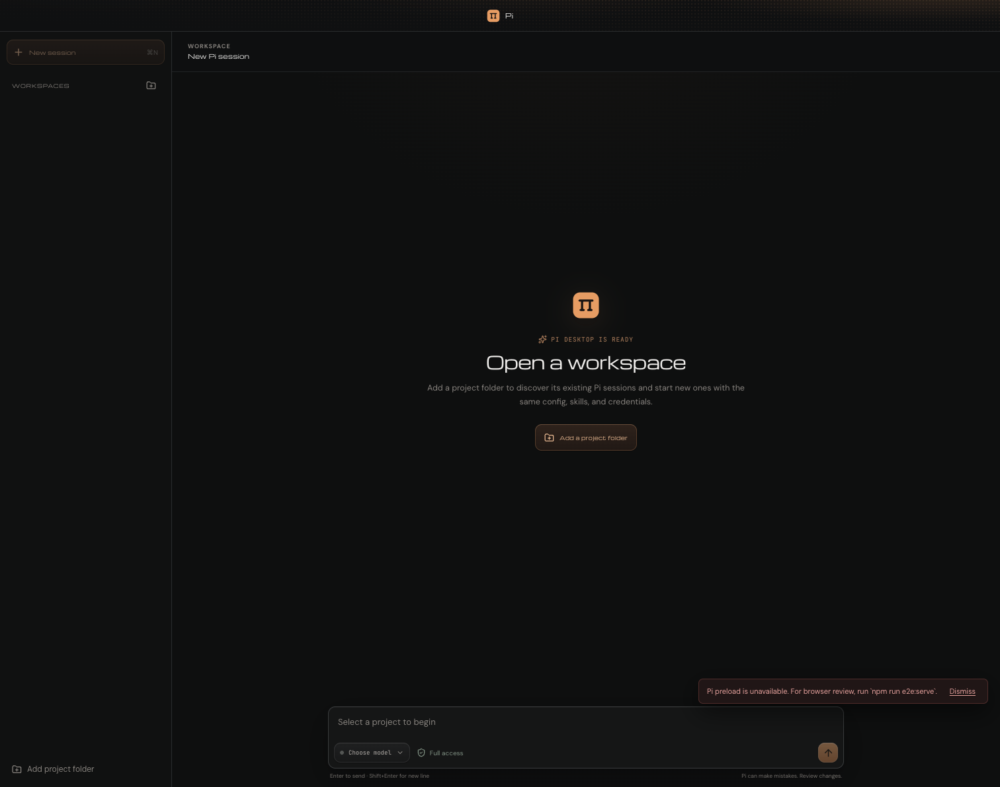

# Skill Audit — Pi Desktop UI

**Branch:** `skill-audit`  
**Model:** `opencode/deepseek-v4-flash-free`  
**Date:** 2026-08-02

## Skills Applied

| Skill | Focus | Verdict |
|-------|-------|---------|
| better-ui | Polish, animations, icons, shadows | Needs changes → Fixed |
| better-layout | Grouping, alignment, logical props | Approve (all LOW) → Fixed |
| better-typography | Type scale, smoothing, wrap, tabular | Approve with suggestions → Fixed |
| better-colors | OKLCH, tokens, contrast | Needs changes → Fixed |
| better-accessibility | Focus, ARIA, hit areas, screen reader | Needs changes → Fixed |
| better-writing | Button labels, errors, voice | Needs changes → Fixed |

## Before / After

### Main View

| Before | After |
|--------|-------|
|  |  |

### Full Page

| Before | After |
|--------|-------|
|  |  |

## Changes Applied

### CSS (`styles.css`)

| Category | Before | After | Why |
|----------|--------|-------|-----|
| Font smoothing | No antialiasing | `-webkit-font-smoothing: antialiased; -moz-osx-font-smoothing: grayscale` | Sharper text on macOS/Electron |
| Image outlines | No outline on `` | `outline: 1px solid oklch(1 0 0 / 0.1); outline-offset: -1px` | Consistent depth separation on dark surfaces |
| Scale on press | `translateY(1px)` only | `scale(0.96) translateY(1px)` | Tactile press feedback (principle: always 0.96) |
| Logical props | 13× `margin-left`/`padding-left`/`padding-right` | `margin-inline-start`/`padding-inline-start`/`padding-inline-end` | RTL-ready layout |
| Breathing room | `.ask-user-options { gap: 7px }` | `gap: 10px` | Bordered controls need ≥12px gap |
| Align edges | `.subagent-pane-header { padding: 0 12px 0 14px }` | `padding: 0 14px` | Symmetric inline padding |
| Align edges | `.section-label-row { padding: 0 4px 0 8px }` | `padding: 0 8px` | Consistent label edge |
| Text wrap | No `text-wrap` on headings | `text-wrap: balance` on `.markdown h1-h3` and `.conversation-empty h2` | Balanced line breaks |
| Tabular nums | No tabular figures | `font-variant-numeric: tabular-nums` on `.session-time`, `.git-totals`, `.preview-rail-count` | Stable digit alignment on changing values |
| Hit area | `.composer-attachment-remove` 21×21px | 24×24px | Meets WCAG 2.5.8 minimum target size |

### Components

| File | Before | After | Why |
|------|--------|-------|-----|
| `AskUserPanel.tsx:145` | `"Submit answer"` | `"Submit"` | Verb-first, redundant "answer" |
| `Composer.tsx:14` | `xhigh: "XHigh"` | `xhigh: "Very high"` | Plain language, not API enum |
| `BackgroundProcessesPane.tsx:10` | `stopped: "Historical"` | `stopped: "Previous"` | Clearer status label |
| `BrandMark.tsx:4` | `fill="#E9A868"` | `fill="var(--accent)"` | Single source of truth for accent color |

## Guidelines (better-layout)

The layout review added these guide lines for visual reference:

```
┌─ Intra-group gap: 8px ─────────────────────────────┐
│  ┌─────────┐  ┌─────────┐  ┌─────────┐             │
│  │ Option  │  │ Option  │  │ Option  │             │
│  └─────────┘  └─────────┘  └─────────┘             │
└────────────────────────────────────────────────────┘
                    ↕ 10px inter-group gap (was 7px)
┌────────────────────────────────────────────────────┐
│  ┌─────────┐  ┌─────────┐  ┌─────────┐             │
│  │ Option  │  │ Option  │  │ Option  │             │
│  └─────────┘  └─────────┘  └─────────┘             │
└────────────────────────────────────────────────────┘

Alignment edges (was asymmetric):
  Before: padding: 0 12px 0 14px  (4px diff)
  After:  padding: 0 14px         (symmetric)

Logical properties (RTL-ready):
  Before: margin-left: auto
  After:  margin-inline-start: auto
```

## Remaining Items (LOW)

- Prompt queue separator between items (cosmetic, not blocking)
- Composer toolbar padding increase (minor breathing room)
- "Pi-managed" → "Created by Pi" (voice consistency, LOW)
- Trailing ellipsis on disabled-state text
